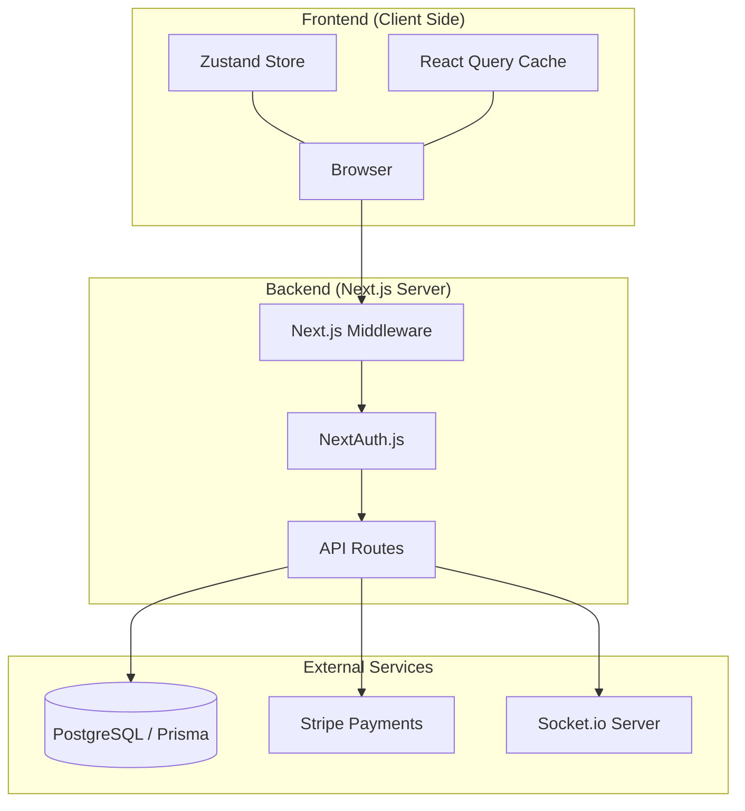

# Project Analysis: Coupang Clone (Multi-Vendor Shopping Mall)

## 1. Core Technology Stack
- **Framework**: [Next.js 14.2.5 (App Router)](https://nextjs.org/)
- **Language**: [TypeScript](https://www.typescriptlang.org/)
- **Database**: [PostgreSQL](https://www.postgresql.org/) with [Prisma ORM](https://www.prisma.io/)
- **Authentication**: [NextAuth.js v5 (Beta)](https://authjs.dev/)
- **State Management**: [Zustand](https://zustand-demo.pmnd.rs/) & [TanStack Query](https://tanstack.com/query/latest)
- **Styling**: [Tailwind CSS](https://tailwindcss.com/) & [Radix UI](https://www.radix-ui.com/)
- **Payments**: [Stripe](https://stripe.com/)
- **Real-time**: [Socket.io](https://socket.io/)
- **Testing**: [Playwright](https://playwright.dev/)

## 2. Key Modules & Responsibilities

| Module | Location | Description |
|--------|----------|-------------|
| **Auth** | `src/lib/auth.ts`, `src/app/api/auth` | Handles JWT-based authentication and role-based access control (RBAC). |
| **Products** | `src/app/products`, `src/app/api/products` | Manages product catalog, search, and category filtering. |
| **Orders** | `src/app/api/customer/orders` | Handles multi-vendor order creation and status tracking. |
| **Payments** | `src/app/api/payments` | Integrates with Stripe for secure transaction processing and webhooks. |
| **Vendor** | `src/app/api/admin/vendors` | Management interface for sellers to handle products and settlements. |
| **Chat** | `src/app/api/chat` | Real-time messaging between customers and vendors. |
| **Admin** | `src/app/admin`, `src/app/api/admin` | Global system monitoring, analytics, and vendor approval. |

## 3. System Architecture

## 4. Role-Based Access Control (RBAC)
- **CUSTOMER**: Can browse products, manage cart/wishlist, place orders, and chat with vendors.
- **VENDOR**: Can manage their own products, view orders for their products, and chat with customers.
- **ADMIN**: Full access to the system, including vendor approval, analytics, and global settings.

## 5. Directory Structure Summary
- `src/app`: File-based routing and API endpoints.
- `src/components`: UI library (Radix) and reusable components.
- `src/lib`: Core library initializations (Prisma, Auth).
- `src/store`: Client-side state management.
- `prisma/`: Database schema definitions.
- `e2e/`: Playwright test suites.
